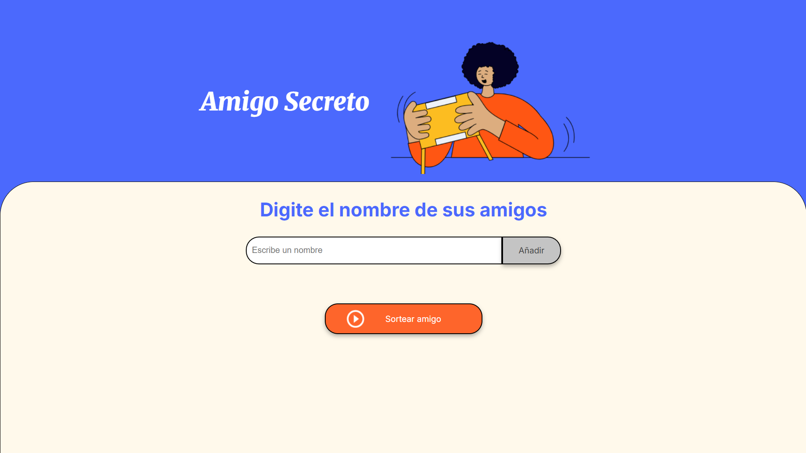
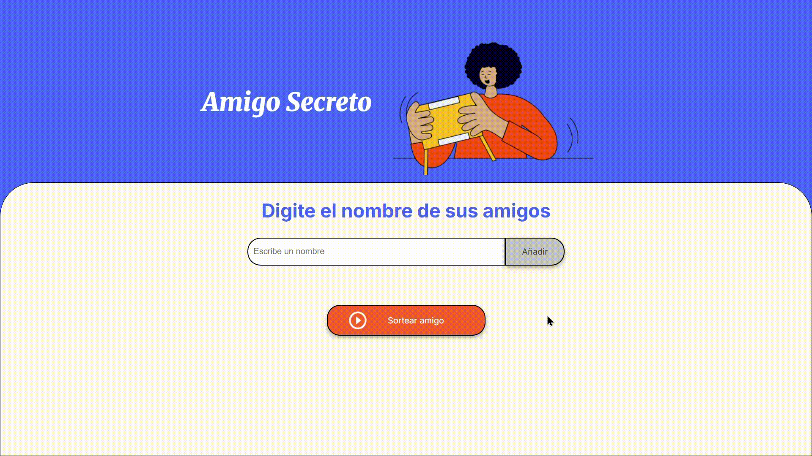

# Amigo Secreto - Challenge

## Descripción
Este proyecto es una aplicación web que permite a los usuarios ingresar una lista de amigos y sortear aleatoriamente un "Amigo Secreto" entre ellos. Es ideal para eventos y juegos en los que se quiere asignar un amigo secreto de manera justa y divertida.

## Funcionalidades
- Agregar nombres a la lista de participantes.
- Validar que los nombres ingresados sean correctos (solo letras y sin duplicados).
- Sortear un amigo secreto aleatoriamente.
- Ocultar la lista al realizar el sorteo y mostrar únicamente el nombre sorteado.
- Mostrar un botón de reinicio cuando todos los amigos han sido sorteados.
- Permitir reiniciar el sorteo sin necesidad de recargar la página.

## Cómo usarlo
Aquí tienes un video demostrativo sobre cómo utilizar la aplicación:

## Proyecto en producción
Puedes acceder a la versión desplegada en Vercel a través del siguiente enlace:

🔗 [Acceder a la aplicación](https://challenge-amigo-secreto-lemon-rho.vercel.app/)
